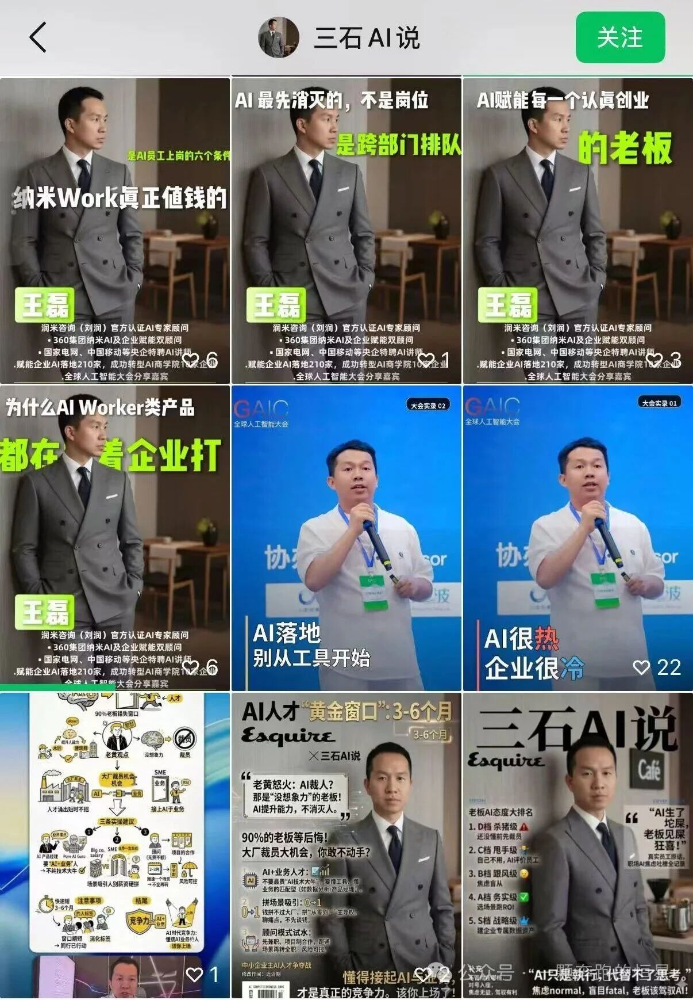
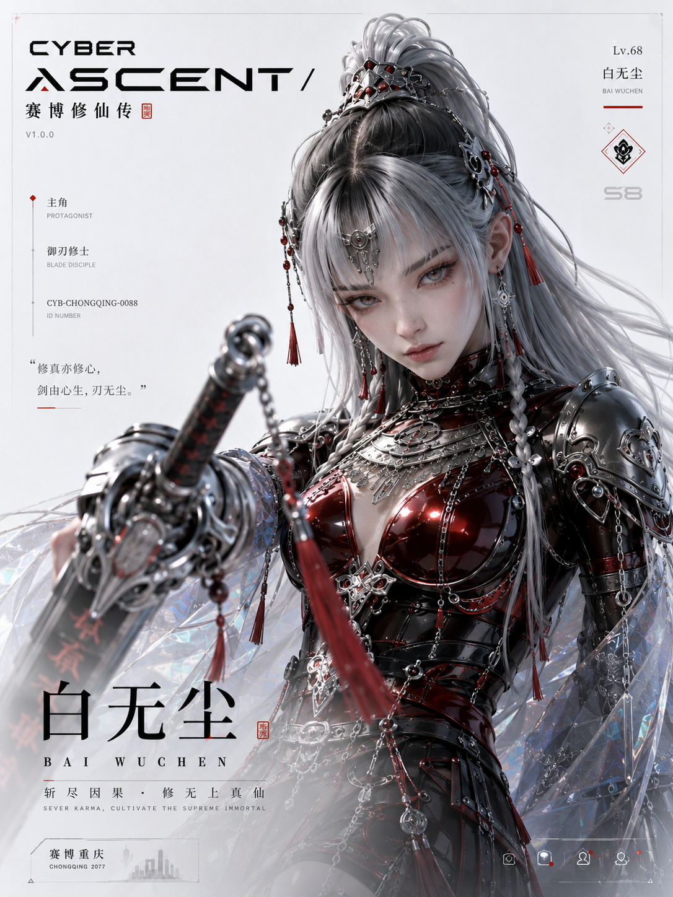
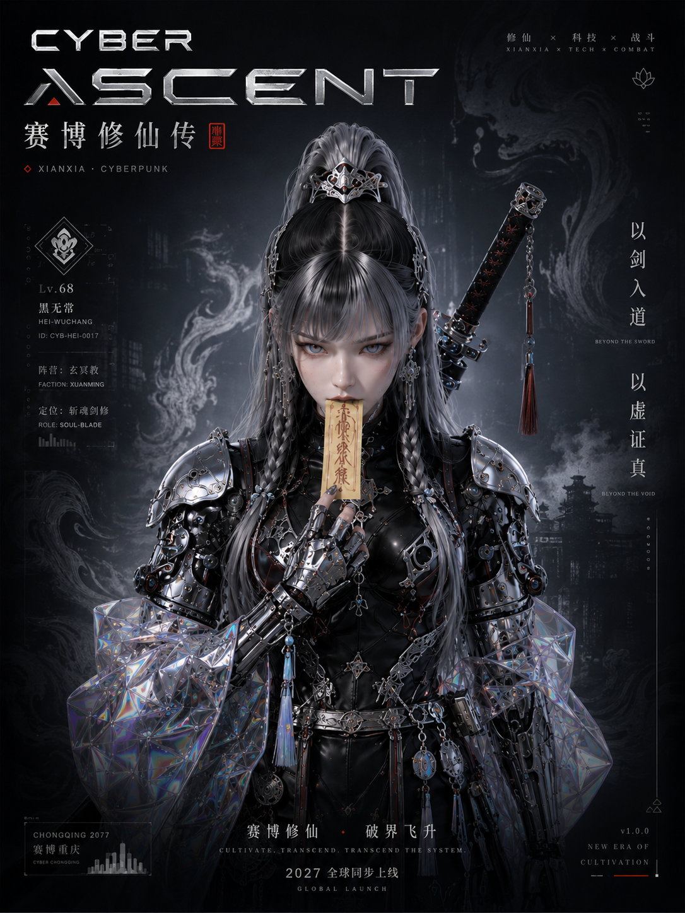
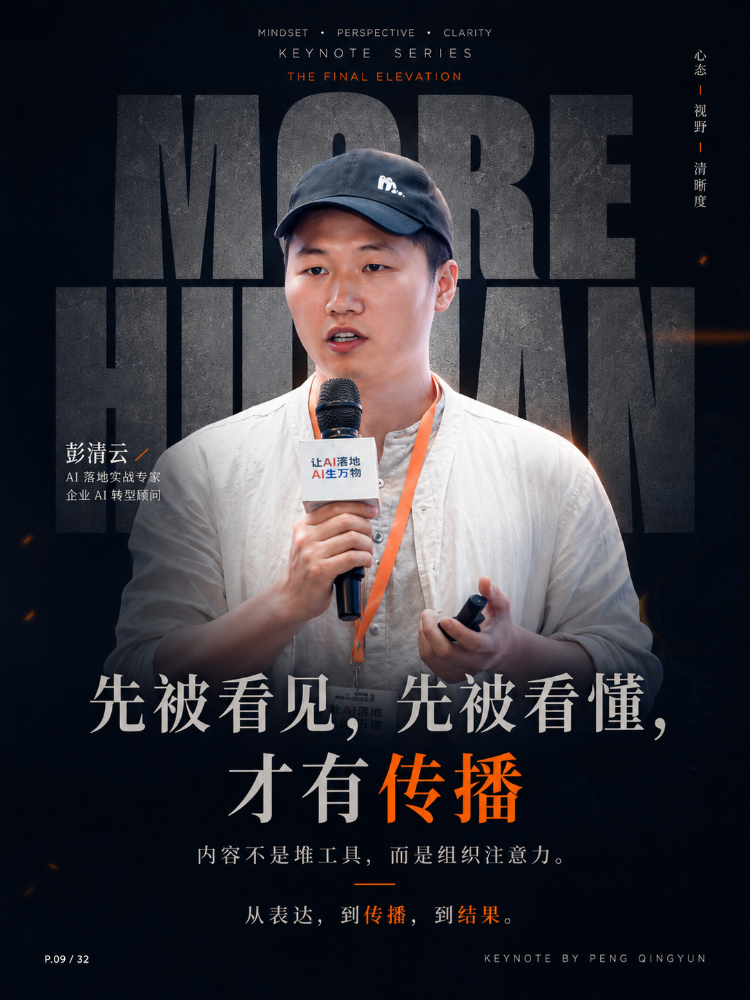
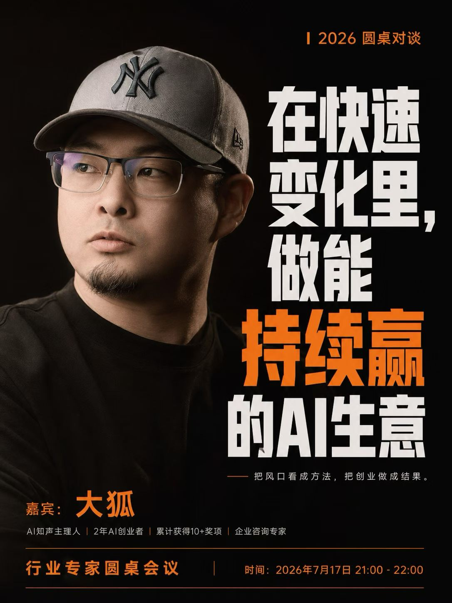
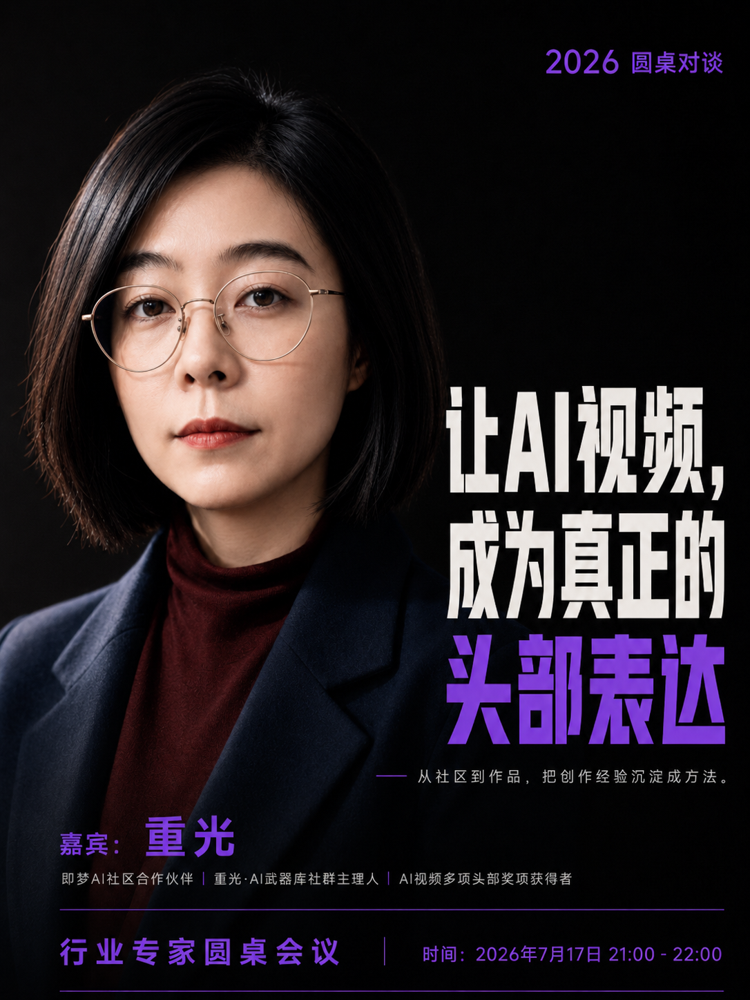
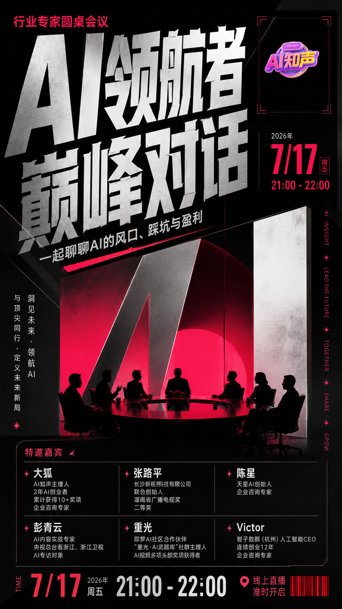
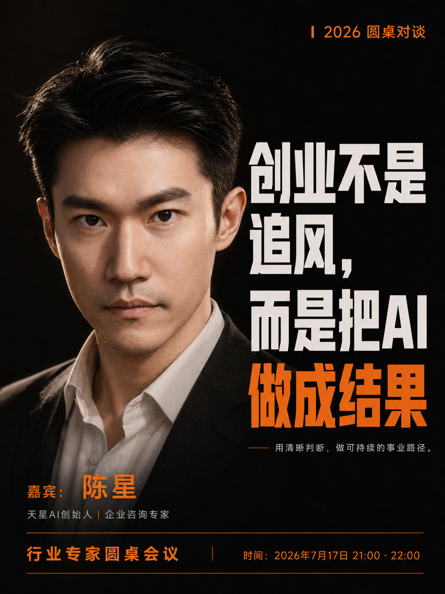

# Qingyun IP Poster

<p align="center">
  <strong>One Skill for business IP batches, keynote statements, event campaigns, and creative character key art.</strong>
</p>

<p align="center"><code>$qingyun-ip-poster</code></p>

<p align="center">
  <a href="README.zh-CN.md">简体中文</a> ·
  <a href="#real-account-case-from-disconnected-covers-to-a-repeatable-visual-system">Case Study</a> ·
  <a href="#one-command-install">Install</a> ·
  <a href="https://github.com/qingyunAGI/qingyun-ip-poster/releases/latest">Latest Release</a>
</p>

<p align="center">
  
  
  
  
</p>

## Real account case: from disconnected covers to a repeatable visual system

After putting the Skill into his real publishing workflow, Wang Lei replied, “I’m using it.” The point of this case is not a single lucky poster. It shows how one person can build repeatable visual rules across an account.

<table>
  <tr>
    <th width="50%">Before: crowded hierarchy and an unstable subject anchor</th>
    <th width="50%">After: consistent subject, headline, and brand rules</th>
  </tr>
  <tr>
    <td></td>
    <td></td>
  </tr>
</table>

Four visible changes:

- **Clearer hierarchy** — headline, subject, identity, and supporting copy no longer compete at the same level.
- **The person becomes the anchor** — thumbnails identify the speaker before asking readers to parse the claim.
- **Stable visual DNA** — dark field, bold type, subject scale, and footer logic stay consistent while layouts still vary.
- **Built for continuous publishing** — each cover works alone and the grid reads as one recognizable series.

> Evidence boundary: these are not same-topic, same-copy, same-date A/B samples. They support a visual-order comparison only and do not establish traffic or conversion lift. Read the case article: [I open-sourced my commercial-grade poster Skill](https://mp.weixin.qq.com/s/NRuhMds4UYYwiZ-aJpjv0A).

### Five business-IP masters for Wang Lei

<p align="center">
  
  
  
  
  
</p>

The five masters share one identity and brand order while changing camera distance, subject placement, headline structure, scene, and information density. They are not one layout recolored five times.

## New in v1.1

### Cyber-xianxia: high-key character dossier × dark worldview key art

<p align="center">
  
  
</p>

### Keynote statement × speaker-card series

<p align="center">
  
  
  
</p>

### 9:16 event master × 3:4 speaker derivative

<p align="center">
  
  
</p>

Together with the five business-IP masters shown above, the Skill includes a [12-image user-supplied reference library](assets/style-references/). Embedded names, roles, awards, dates, logos, version labels, and character copy have not been fact-checked by this repository. Treat them only as layout references, never as reusable claims, and confirm portrait and brand authorization before use.

The event-master source is preserved at its original `941 × 1672` size, which is approximately 9:16; production outputs should use exact `1080 × 1920` or another true 9:16 size. Any `V1.0.0` visible inside sample artwork belongs to the sample copy, not the current Skill release.

## One-command install

Windows PowerShell:

```powershell
git clone https://github.com/qingyunAGI/qingyun-ip-poster.git "$env:USERPROFILE\.codex\skills\qingyun-ip-poster"
```

macOS / Linux:

```bash
git clone https://github.com/qingyunAGI/qingyun-ip-poster.git ~/.codex/skills/qingyun-ip-poster
```

Restart Codex or reload Skills, then invoke:

```text
$qingyun-ip-poster
```

Update an existing Windows installation with:

```powershell
git -C "$env:USERPROFILE\.codex\skills\qingyun-ip-poster" pull
```

A ZIP package is also available from [GitHub Releases](https://github.com/qingyunAGI/qingyun-ip-poster/releases/latest).

## Four task routes

| Route | Default output | Typical input | Ratio |
| --- | --- | --- | --- |
| Business IP batch | 7 distinct directions; refine 1–3 | 3–5 portraits of one person + statement/credentials | 3:4 |
| Keynote manifesto | 3 directions or one requested poster | Speaker/portrait photo + one verified statement | 3:4 |
| Event campaign set | 1 event master + N speaker cards | Event fact sheet + logo + speaker data/photos | 9:16 + 3:4 |
| Creative IP key art | High-key dossier + dark key-art pair | Character reference or character/world brief | 3:4 |

This is not a larger image folder attached to the old workflow. Version 1.1 routes the task first, then selects the required materials, ratio, grid, batch size, and quality gates. Event campaigns follow the actual speaker count instead of forcing every request into 5/7/10 outputs.

## Core principles

- **Information first** — read the claim, character, or event before the supporting details.
- **Identity fidelity** — use supplied portraits as identity anchors; never generate a real person from a name alone.
- **Factual discipline** — names, roles, awards, figures, dates, logos, and quotes must come from supplied or traceable sources.
- **Layered production** — generate subject, scene, light, material, and safe zones; typeset exact Chinese, logos, and dates in a controlled layer.
- **Series coherence** — share grids, typography, subject scale, lighting ratios, and footers while varying shot, pose, scene, and narrative.
- **Single emphasis** — keep one visual center, one accent phrase, and one saturated accent color per poster.

## Workflow

1. **Route** the request into business IP, keynote, event campaign, or character key art.
2. **Compile facts** into one information card with supplied, verified, and unverified states.
3. **Select a pattern** from the 12 references without copying sample-specific claims or identities.
4. **Generate artwork** with the required subject, scene, light, material, and clean type-safe zones.
5. **Typeset exact content** including Chinese, names, dates, logos, speaker grids, and footers.
6. **Run QA** for identity, character continuity, facts, text, anatomy, props, thumbnail readability, and platform crop safety.
7. **Refine** the strongest 1–3 directions.

## Example calls

```text
$qingyun-ip-poster
Here is my current account grid and five portraits. Audit subject anchoring, headline hierarchy,
thumbnail readability, and series consistency first. Then define a repeatable visual DNA and
create seven genuinely different 3:4 compositions.
```

```text
$qingyun-ip-poster
Use these four portraits to create seven distinct 3:4 personal-IP posters.
Preserve the headline and credentials exactly, and vary camera distance, position,
scene, and title structure across the batch.
```

```text
$qingyun-ip-poster
Create one 9:16 event master and six 3:4 speaker statement cards.
Use only the dates, times, names, roles, and logo in my event fact sheet.
```

```text
$qingyun-ip-poster
Use this character sheet to create a high-key dossier and a dark worldview key-art pair.
Lock the face, silver hair, crown, mechanical armor, weapon, and restrained dark-red accent.
Avoid neon-city cyberpunk and full-screen HUD graphics.
```

## Commercial implementation and customization

For a continuous visual system across a personal account, course, event, or team, open a [GitHub Issue](https://github.com/qingyunAGI/qingyun-ip-poster/issues/new) with the platform, output count, timing, current visual problem, and any public-safe references. Do not attach private source portraits or confidential business information to a public issue.

## Delivery gate

Do not deliver a version with:

- Real-person identity drift or inconsistent character continuity.
- Incorrect Chinese, names, roles, dates, times, or logos.
- Invented awards, clients, events, brands, or real-person claims.
- Broken hands, microphones, swords, chains, armor, furniture, or body proportions.
- Critical information inside a platform crop or UI danger zone.
- An unreadable subject or core statement at thumbnail size.
- Batch “variation” created only by recoloring one layout.

## Repository structure

```text
qingyun-ip-poster/
├── SKILL.md
├── agents/
│   └── openai.yaml
├── assets/
│   ├── case-studies/           # real-account before/after evidence
│   └── style-references/       # 12 original poster references
├── references/
│   ├── design-system.md
│   ├── failure-modes.md
│   ├── intake-guide.md
│   ├── prompt-compiler.md
│   ├── quality-checklist.md
│   └── version-matrix.md
├── README.md
└── README.zh-CN.md
```

## Author

**Peng Qingyun (Kaiwen)** works across AI video, personal IP, visual storytelling, and reusable creative-production workflows, turning repeated practice into Codex Skills, prompts, and course assets.

GitHub: [@qingyunAGI](https://github.com/qingyunAGI)

---

Current version: **1.1.1**. No open license is currently included; contact the author before redistribution or commercial repackaging.
